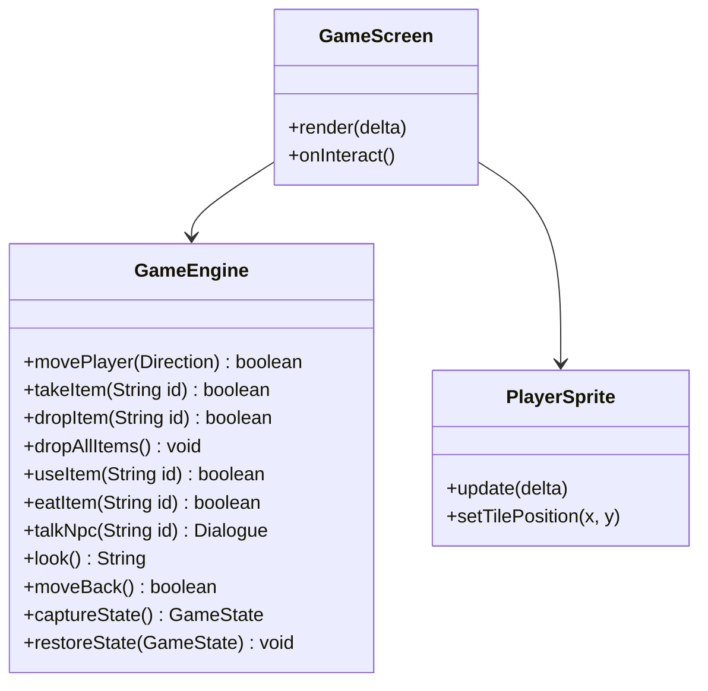
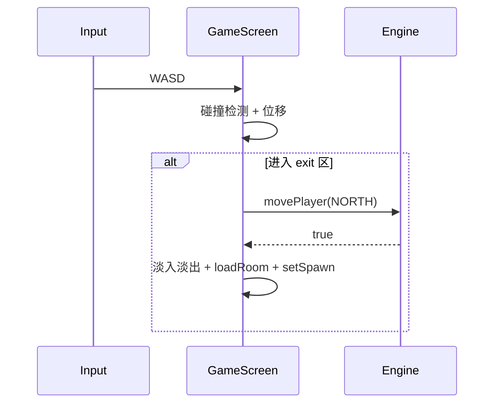
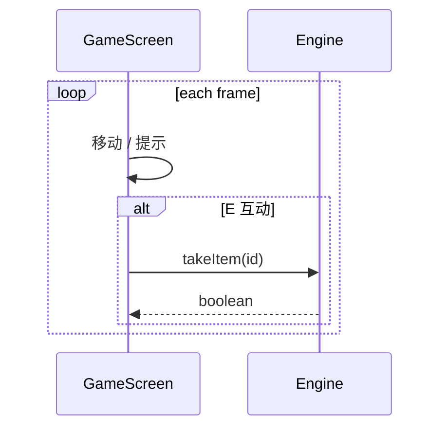

# World of Zuul 拓展项目 — 软件设计说明书（SDD）

**文档版本**：2.1  
**对应需求文档**：`01-需求规格说明书.md` v2.1  
**架构风格**：分层 + Engine API + LibGDX 像素客户端（GUI 唯一入口）  
**文档日期**：2026-05-25  

---

## 1. 设计目标

1. **GUI 唯一入口**：`RpgMain` 为交付主程序；不维护 CLI 循环。  
2. **逻辑与表现分离**：`GameEngine` 不依赖 LibGDX；`GameScreen` 只调用 Engine 公开 API。  
3. **像素 RPG 体验**：Tiled + 精灵动画 + 互动提示 + Scene2D UI。  
4. **数据驱动世界**：Factory + Tiled 对象层 + 对话 JSON。  
5. **可存档**：仅序列化 `GameState` 动态字段。

---

## 2. 系统上下文

```
┌──────────────────────────────────────────────────────────────────┐
│              Chronicle of the Lost Realms（单进程 Java）           │
├──────────────────────────────────────────────────────────────────┤
│  Presentation：LibGDX 客户端                                       │
│  RpgMain → TitleScreen / GameScreen / Hud / DialogueBox          │
└──────────────────────────────┬───────────────────────────────────┘
                               │ GameEngine API（无字符串命令）
                               ▼
        ┌──────────────────────────────────────────────┐
        │              GameEngine                       │
        │  movePlayer · takeItem · talkNpc · Quest…   │
        └──────────────────────┬───────────────────────┘
                               │
               ┌───────────────┼───────────────┐
               ▼               ▼               ▼
        ┌──────────┐   ┌────────────┐   ┌─────────────┐
        │ Domain   │   │ WorldFactory│   │ Persistence │
        └──────────┘   └────────────┘   └─────────────┘
                               ▼
                    assets/maps · sprites · dialogue
```

**关键原则**：无 Web API、无独立数据库服务；**GameEngine 即应用内核**。

---

## 3. 逻辑架构（四层）

| 层 | 职责 | 包路径 | 主要类 |
|----|------|--------|--------|
| **Client** | 渲染、输入、UI | `...zuul.client` | `RpgMain`, `GameScreen`, `Hud`, `DialogueBox` |
| **Application** | 游戏规则与流程 | `...zuul.engine` | `GameEngine`, `QuestManager`, `EndingEvaluator` |
| **Domain** | 实体 | `...zuul.domain` | `Room`, `Item`, `Player`, `Npc`, `Interactable` |
| **Infrastructure** | 世界、存档、资源 | `...zuul.infra` | `WorldFactory`, `SaveGameService`, `AssetCatalog` |

### 3.1 依赖规则

```
client  ──► engine ──► domain
engine  ──► infra  ──► domain
client  ──X──► domain   （禁止 UI 直接改 Room 状态）
```

### 3.2 关于原 Command / Parser

原 Zuul 的 `Command`、`Parser` **不对外暴露**。`GameEngine` 内部可用私有 `*Handler` 组织逻辑（原 Command 类可逐步迁入），但 **GUI 只认 Engine 方法**，不使用 `GameCommand` 字符串分发。

---

## 4. 技术选型

| 领域 | 选型 | 版本 |
|------|------|------|
| 语言 | Java | 8+ |
| 构建 | Maven | — |
| 2D | LibGDX | 1.12.1 |
| 地图 | Tiled | 1.10+ |
| 存档 | Gson JSON（推荐） | — |
| 测试 | JUnit 5 | — |

**不采用**：CLI 交付、JavaFX、Web 前端、MySQL。

```xml
<dependency>
    <groupId>com.badlogicgames.gdx</groupId>
    <artifactId>gdx</artifactId>
    <version>1.12.1</version>
</dependency>
<dependency>
    <groupId>com.badlogicgames.gdx</groupId>
    <artifactId>gdx-backend-lwjgl3</artifactId>
    <version>1.12.1</version>
</dependency>
```

---

## 5. 核心类设计

### 5.1 类图（引擎 + 客户端）



### 5.2 GameEngine API（冻结见 `04` §10）

```java
public final class GameEngine {
    public boolean movePlayer(Direction direction);
    public boolean takeItem(String itemId);
    public boolean dropItem(String itemId);
    public void dropAllItems();
    public boolean useItem(String itemId);
    public void eatItem(String itemId);      // magic cookie → maxWeight += 20
    public Dialogue talkNpc(String npcId);
    public String look();
    public boolean moveBack();
    public GameState captureState();
    public void restoreState(GameState state);
}
```

- 返回 `boolean` 表示成败；GUI 用浮动文字提示失败原因（超重、门锁定等）。  
- 复杂结果（对话）返回 `Dialogue` 对象给 `DialogueBox`。

### 5.3 GUI → Engine 映射

| GUI 操作 | Engine 调用 |
|----------|-------------|
| 进入出口 / 顶门 | `movePlayer(direction)` |
| E 拾取 | `takeItem(itemId)` |
| E 对话 | `talkNpc(npcId)` |
| 背包使用 | `useItem` / `eatItem` |
| Q 调查 | `look()` |
| B 回退 | `moveBack()` |
| ESC 存档 | `SaveGameService.save(captureState())` |

### 5.4 领域模型要点

**Room**：`roomId`, `description`, `lockId`, `isTeleport`, `exits`, `items`, `npcs`, `scene`  
**Player**：`name`, `hp`, `maxWeight`（初始 50）, `inventory`, 逻辑 `currentRoom`  
**Item**：`itemId`, `weight`, `type`, `effect`（如 `unlock:vault-door`）  
**Interactable**：`hintText`, `actionType`（take/talk/use）

---

## 6. 像素客户端设计

### 6.1 Screen 栈

| Screen | 职责 |
|--------|------|
| `TitleScreen` | 背景、**TextField 输入玩家姓名**（默认「编年史者」）、新游戏/读档 |
| `GameScreen` | 主玩法 |
| `PauseOverlay` | ESC 菜单 |
| `EndingScreen` / `GameOverScreen` | 结局 / 死亡 |

**新游戏流程**：TitleScreen 读取姓名 → `WorldFactory.build()` → `engine.restoreState(initial)` → GameScreen。

### 6.2 渲染管线

1. Tiled 层 ground → wall → decor  
2. 按 Y 排序绘制实体  
3. `InteractionHintSystem`  
4. Scene2D HUD / 对话框  

`TextureFilter.Nearest` 保持像素清晰。

### 6.3 移动、出口与房间切换



| 组件 | 说明 |
|------|------|
| `CollisionSystem` | 读 `wall` 层 |
| `MovementController` | 4 格/秒 |
| `ExitZone` | objects 层 `type=exit` |

`movePlayer` 成功后，GUI 根据 `GameState.entryDirection` 的**反方向**在目标房选取 `spawn`（见 `04` §4）。

### 6.4 互动提示

`InteractionHintSystem` 选最近 Interactable，绘制「E」；按 E 调用对应 Engine API。

### 6.5 UI 组件

`Hud`, `DialogueBox`, `InventoryPanel`, `MiniMap`, `FloatingText`。

### 6.6 场景过渡

跨 Room 淡入淡出 0.3–0.5s；输入锁定至加载完成。

---

## 7. Tiled 与内容工作流（成员 A）

目录结构与风格见 `05-美术资源设计说明书.md`；技术参数见 `04` §2、§7。推荐 **一 Room 一 tmx**。

### 7.1 多入口 spawn

- spawn 对象属性 `direction=north|south|east|west|default`  
- 从北侧进入本房 → 使用 `direction=south` 的 spawn（玩家在房间南侧出现）  
- 无匹配时用 `default`

### 7.2 传送房间（统一规则）

**规则（全文统一）**：

1. 玩家经 `movePlayer` **已成功进入**房间 `R`，且 `R.isTeleport() == true`；  
2. **在同一调用内**，Engine 立即执行 `currentRoom = WorldFactory.randomRoomExcept(R.roomId)`；  
3. `entryDirection` 置为 `default`，玩家落在目标房 `default` spawn；  
4. 向 GUI 发送 `GameEvent.TELEPORTED`（闪白特效 + 加载新地图）。

```java
private void resolveTeleportIfNeeded() {
    if (!currentRoom.isTeleport()) return;
    String fromId = currentRoom.getRoomId();
    currentRoom = WorldFactory.randomRoomExcept(fromId);
    entryDirection = Direction.DEFAULT;
    // roomHistory 仍记录进入传送房之前的历史，便于 back
}
```

**注意**：传送房**没有**「再选出口」步骤；进入即触发。仅 `teleport-alcove`（可扩展同类房间）设置 `isTeleport=true`。

### 7.3 对话 JSON

`assets/dialogue/<npcId>.json`，格式见 `04` §6。`talkNpc` 加载并返回 `Dialogue`。

### 7.4 精灵表

见 `04` §7（玩家 4×4 帧，32×32）。

---

## 8. GameEngine 核心逻辑

### 8.1 movePlayer

```java
public boolean movePlayer(Direction direction) {
    Room next = currentRoom.getExit(direction.name().toLowerCase());
    if (next == null) return false;
    if (!isPassable(next, direction)) return false; // 锁门等

    roomHistory.push(currentRoom.getRoomId());
    entryDirection = direction;
    currentRoom = next;
    resolveTeleportIfNeeded();
    questManager.onRoomEntered(currentRoom);
    return true;
}
```

### 8.2 takeItem / 负重

超重则放回房间并返回 `false`（见 `04` §8）。

### 8.3 moveBack（高级 back）

```java
public boolean moveBack() {
    if (roomHistory.isEmpty()) return false;
    String prevId = roomHistory.pop();
    Direction reverse = entryDirection.opposite();
    currentRoom = WorldFactory.getRoom(prevId);
    entryDirection = reverse;
    return true;
}
```

**GUI 责任**：`moveBack` 成功后，根据 `entryDirection` 调用 `RoomScene.resolveSpawn(entryDirection)`，**将 PlayerSprite 设到对应格子中心**，避免回退后坐标留在墙里。

### 8.4 use / eat / Quest / Ending

`UseEffect` 策略；`QuestManager` 监听房间/物品/NPC 事件；`EndingEvaluator` 三结局。

---

## 9. 存档设计

`GameState` 字段见 `04` §11。Load 后：

1. `engine.restoreState(state)`  
2. `GameScreen.loadRoom(currentRoomId)`  
3. `playerSprite.setTilePosition(playerX, playerY)` 或由 `entryDirection` 解析 spawn  

---

## 10. GUI 主循环时序



---

## 11. 包结构

```
cn.edu.whut.sept.zuul/
├── RpgMain.java
├── domain/
├── engine/
├── infra/
└── client/
    ├── screen/   (Title, Game, Ending, GameOver)
    ├── entity/   (PlayerSprite)
    ├── system/   (Collision, Hints, Transition)
    └── ui/       (Hud, DialogueBox, InventoryPanel)
```

| 分支 | 职责 |
|------|------|
| world-data | domain 内容、tmx、dialogue JSON |
| commands-gameplay | GameEngine、Quest、Player |
| persistence-ui | client 全家桶、Save/Load |

---

## 12. 输入映射汇总

| 操作 | GUI | Engine |
|------|-----|--------|
| go | 出口区 | `movePlayer` |
| look | Q / 进房 | `look()` |
| take | E | `takeItem` |
| drop / drop all | 背包 | `dropItem` / `dropAllItems` |
| items | I | 读 inventory + `look` 物品段落 |
| eat cookie | 背包 | `eatItem` |
| talk | E | `talkNpc` |
| back | B | `moveBack` |
| save/load | ESC | SaveGameService |
| map | M | `captureState().exploredRoomIds` |

---

## 13. 错误处理

| 场景 | GUI |
|------|-----|
| 无出口 | 不可通行提示 |
| 超重 | 「负重不足」 |
| HP≤0 | GameOverScreen |
| 资源缺失 | 占位图 + 日志 |

---

## 14. 测试策略

| 级别 | 内容 | 负责人 |
|------|------|--------|
| **单元** | `GameEngineTest`：move、take 超重、teleport、moveBack、save 往返 | B |
| **集成** | GUI 冒烟：3 房、拾取、存档 | C |
| **CI** | `mvn test` + compile + package | 全员 |

**单测示例场景**（不启动 LibGDX）：

- `movePlayer` 进入传送房后 `currentRoomId` 不等于传送房 id  
- `takeItem` 超重返回 false 且物品仍在房间  
- `moveBack` 后 `entryDirection` 与 spawn 解析一致  

---

## 15. Out of Scope

网络多人、Web、Android、完整 BGM 管线（可预留接口）。

---

## 16. ADR

| 决策 | 理由 |
|------|------|
| GUI 唯一入口 | 聚焦课设演示与 README 项 7 |
| Engine 方法 API，不用 CLI Parser | 避免双轨逻辑；仍可单测 |
| 进入传送房后立即随机 | 与 README 参考项 4 一致，规则简单 |
| 一 Room 一 tmx | 并行编辑、加载快 |
| Gson JSON 存档 | 可读、易调试 |
| TitleScreen 输入姓名 | 满足 README Player 姓名要求 |

---

*文档结束*
